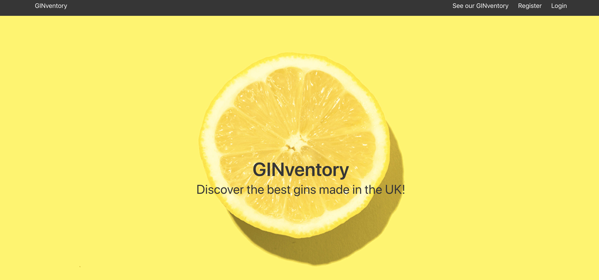
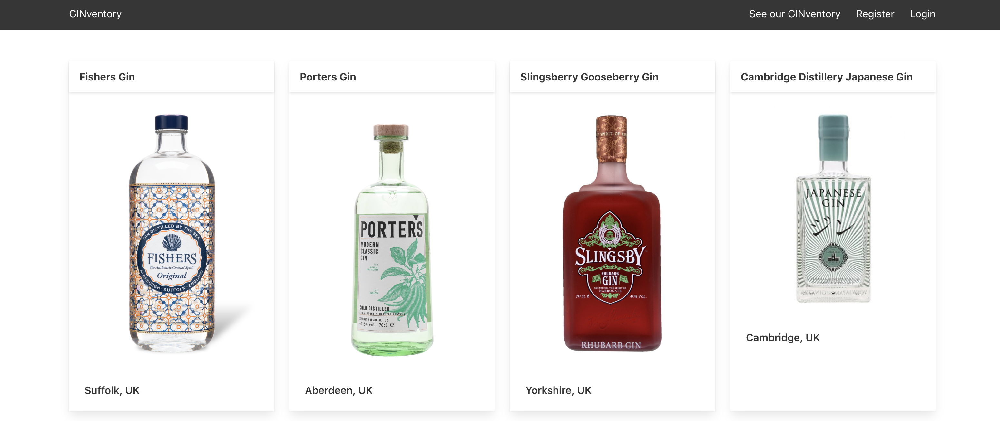
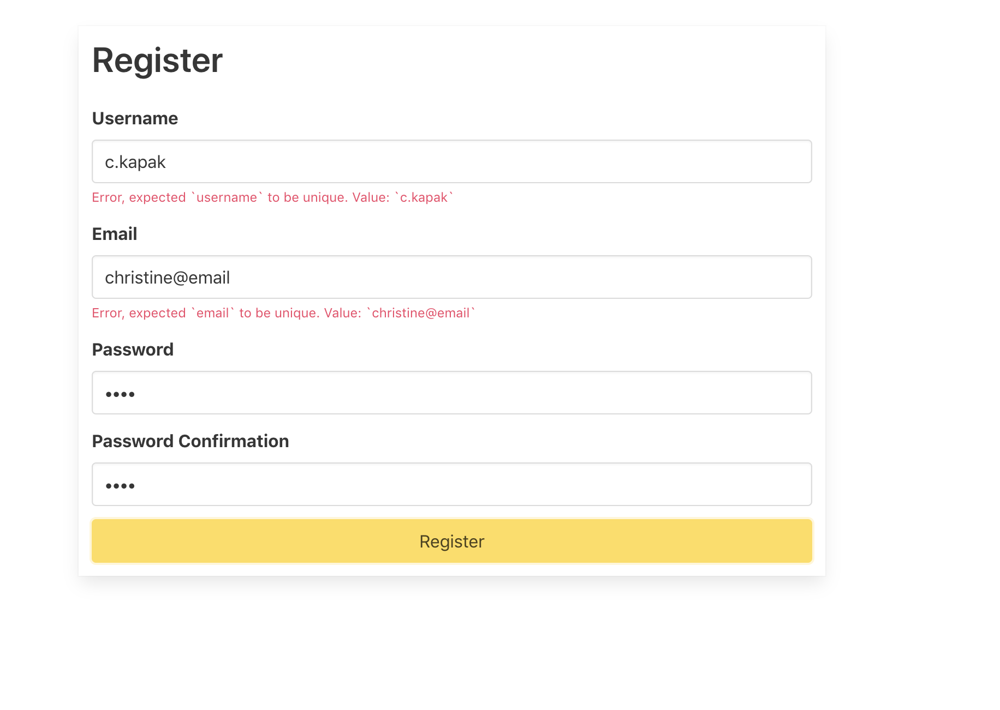
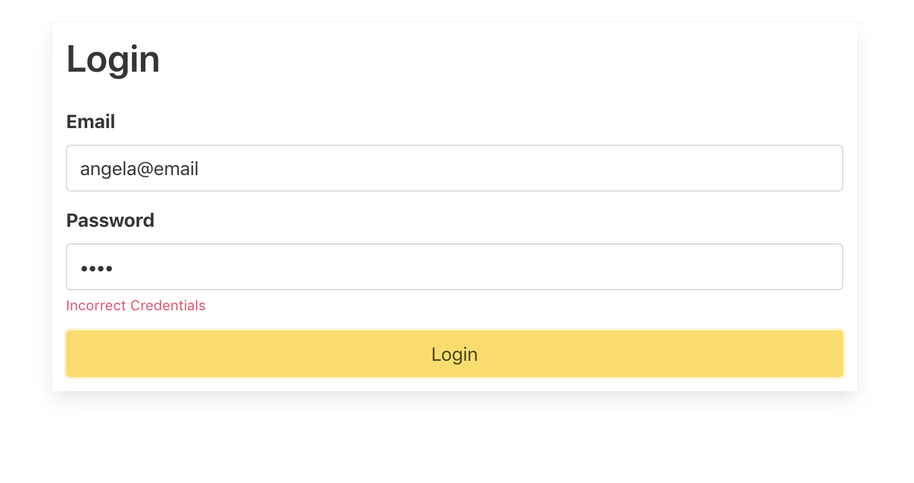
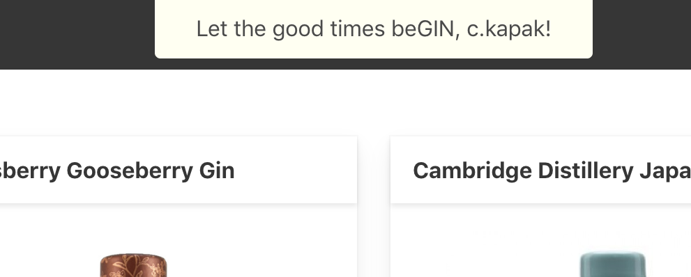
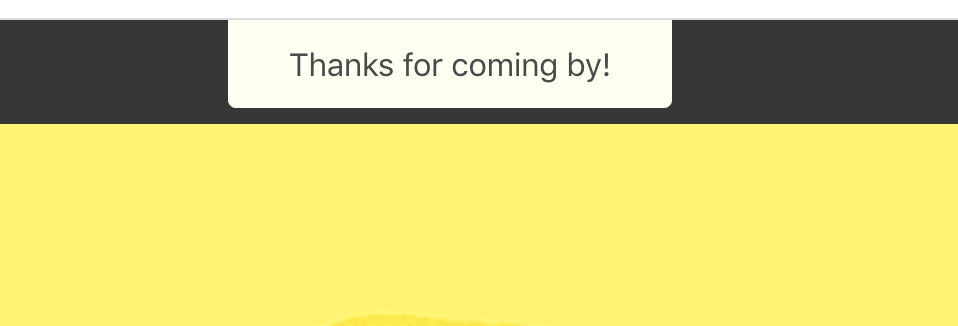
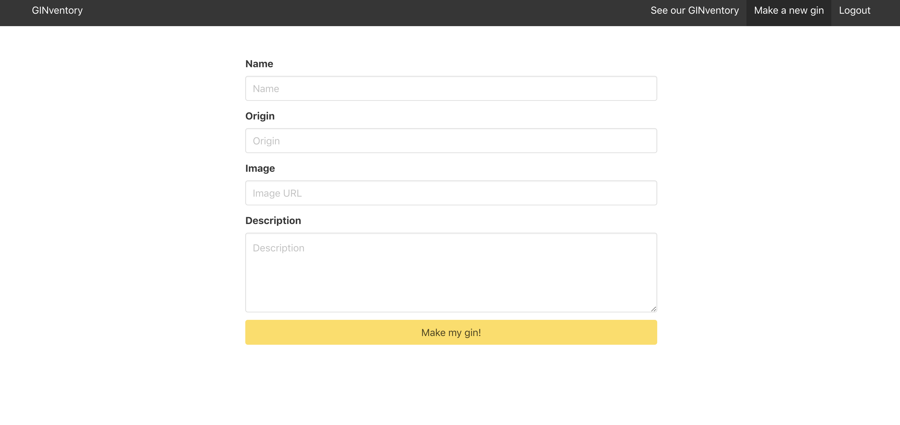
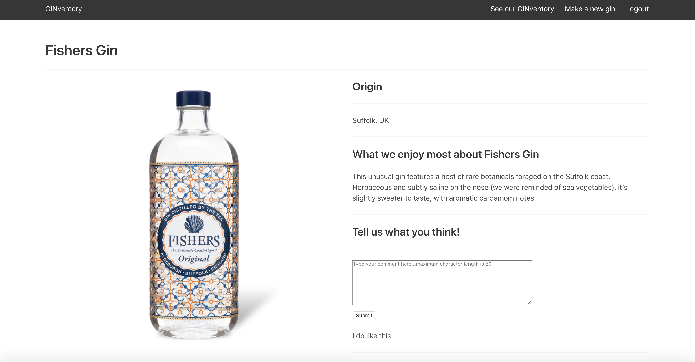

# 'GINventory'
​
## Overview
​
This was a solo project on the Software Engineering Immersive course at General Assembly.

**'GINnventory'** is a library of the UK's favourite gins (according to https://www.olivemagazine.com/drink/best-british-gins/). Once registered and logged in, the user can see the catalogue of gins, add to the GINventory, and make comments on the individual gins. 

## Brief

The task was to build a RESTful Express API from scratch with React in one week. The project should have one model of our choice, should be able to perform INDEX and CREATE actions and include a seeds file.
​
## Technologies

- Javascript
- Bulma
- React.js
- axios
- Node.js
- Express.js
- MongoDB
- Insomnia

## Deployment

​This application was deployed on Heroku at http://ginventory.herokuapp.com/

## Getting started

Use the clone button to download the app source code. In the terminal enter the following commands:

```
<!-- To install all the packages listed in the package.json: -->
$ npm i
<!-- Run the app in your localhost: -->
$ npm run serve
<!-- Check the console for any issues and if there are check the package.json for any dependancies missing
```

## Website Architecture

The app is comprised of the following pages:

### Home 

The user starts on the homepage: 



### View gins

The user can see a catalogue of gins on the 'Show Gins' page:



### Register & Login

To add to the GINventory and make comments, the user must register and log into the app. 

If the user's registeration details (specifically username and email address) had already been taken, an error is flagged on the interface. The user must use unique details:



Similarly, if the user's login details aren't on the system, an error is flagged on the interface:



So when the user successfully registers and logs in, a notification appears at the top of the screen:



When they log out, another notification appears: 



The user is now able to add gins to the GINventory and make comments. 

### Add a gin

The user is able to add a gin to the database via a form:



### Make a comment

The user is able to make comments (seen below the item description) however the comments are currently anonymous. In the future, I would like to attribute the comments to the user:



## Challenges & Future Improvements

Towards the end of the project I implemented a profile page and enabled comments on the SHOW page but - due to time contraints - couldn't complete it, so this is a future improvement. I also want to add an additional model - tonics - to show the perfect gin and tonic pairing. 